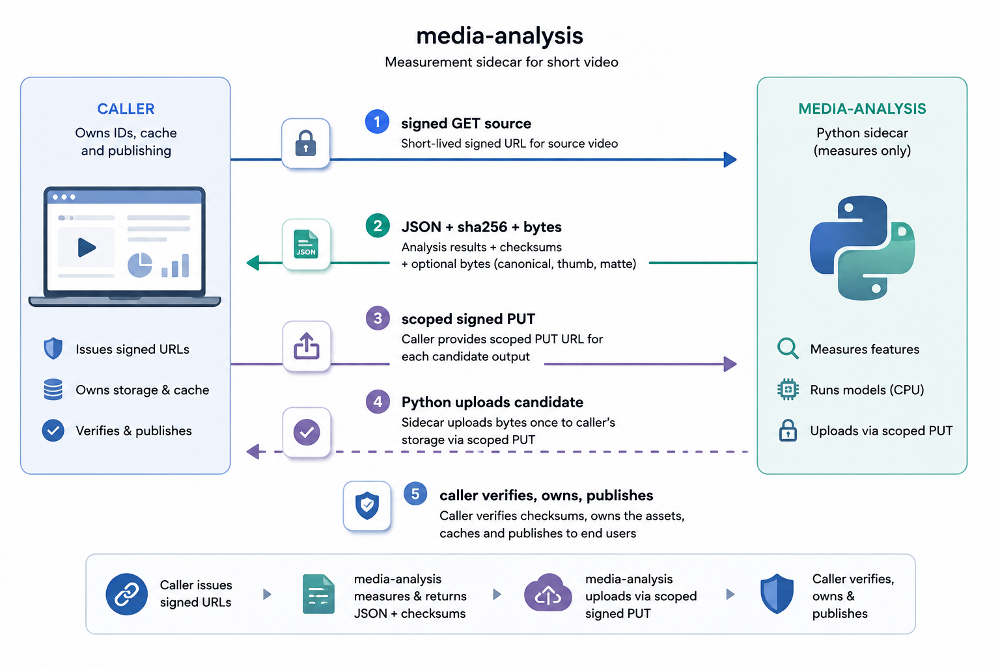

<p align="center">
  
</p>

<h1 align="center">media-analysis</h1>

<p align="center">
  Open-source Python sidecar that <strong>measures</strong> short video.<br>
  Subjects, faces, OCR regions, shots, motion, quality, audio, exposure, thumbnails, and mattes.
</p>

<p align="center">
  <a href="https://github.com/ibrahimjspy/media-analysis/actions/workflows/ci.yml"></a>
  <a href="https://www.python.org/downloads/release/python-3120/"></a>
  <a href="LICENSE"></a>
</p>

It does not edit, caption, or publish assets.

Callers send a short-lived signed GET for the source, request a subset of features, and receive JSON plus checksums. If bytes must leave the process (canonical MP4, thumbnail JPEG, person-matte MP4), the caller issues a key-specific signed PUT and this service uploads once. The caller owns public IDs, cache, and the authoritative matte manifest.



This service only measures. Downstream products decide what to keep, trim, or place.

**Status:** v1, v1.1, and v1.2 are implemented on `analysis-cpu`. The service is
ready for integration testing, but OCR is not yet production-validated because the owned
PP-OCR export parity gate remains closed. v2 Stage 1 is
implemented as an explicitly gated `matte-cpu` reference worker; production matte
serving remains blocked until an owned immutable MODNet export and parity benchmarks exist.

## What this is not

- Not a public internet API and not a JWT / workspace gate
- Not a still-image saliency API
- Not captioning, generation, rendering, or an editor schema
- Not `keep` / `trim` / `reject` edit plans
- Not face recognition or identity
- Not OCR **recognition** (detection polygons only)
- Not depth / parallax
- Not a place for raw masks, image sequences, or Base64 video in JSON
- Not a runtime model downloader — weights are vendored and checksummed

## Version map

Same `POST /analyze` for every version. Unknown feature names return `400 INVALID_REQUEST`.

| Version | Features | Image |
|---|---|---|
| **v1** | `subjects` `faces` `ocr` `shots` + optional canonicalize | `analysis-cpu` |
| **v1.1** | `motion` `quality` `audio` | same |
| **v1.2** | `exposure` `waveform` `thumbnails` | same |
| **v2 Stage 1** | full-duration `person_matte` for `all_people` | separate `matte-cpu` reference image |
| **v3** | per-stage metrics; no new feature names | both |

Motion, quality, exposure, thumbnail selection, and BPM policies are provisional and
versioned in every response. `subject_tracks` matte targeting and segmented matte delivery
are Stage 2 and currently return `400 INVALID_REQUEST`.

Linux **x86_64** is the source of truth. Apple Silicon is smoke-test only; do not treat Mac hashes as production parity.

## License

This repository is licensed under the [Apache License 2.0](LICENSE).

Apache-2.0 matches the default model stack (YOLOX, OpenCV, PaddleOCR, MODNet) and stays compatible with MIT / BSD / ISC dependencies. Third-party notices live in [NOTICE](NOTICE).

**Do not add Ultralytics YOLO** (YOLOv5/v8/v11, `ultralytics` pip) unless you intentionally relicense this project under AGPL-3.0 or obtain an Ultralytics Enterprise license. That is a legal change, not a convenience import.

**FFmpeg:** a typical distro binary that encodes H.264 with `libx264` is a GPL-enabled FFmpeg build. Shipping a Docker image that contains that binary has FFmpeg / x264 source-offer duties. It does **not** relicense the Python in this repo. Record `ffmpeg -version` and the configure line in `decodePipelineVersion`.

Robust Video Matting (RVM) is GPL-3.0 and is a quality reference only. Do not vendor it into an image without a written license decision.

## Requirements

- Python **3.12**
- `ffmpeg` and `ffprobe` on `PATH`
- Docker (optional, recommended for the same image you will deploy)
- About 30 MB of disk for vendored ONNX weights (not committed)

## Quick start (local)

```bash
git clone https://github.com/ibrahimjspy/media-analysis.git
cd media-analysis

python3.12 -m venv .venv
source .venv/bin/activate   # Windows: .venv\Scripts\activate

pip install -U pip
pip install -e ".[dev]"

cp .env.example .env
# set MEDIA_ANALYSIS_KEY and MEDIA_ANALYSIS_ALLOWED_HOSTS
```

Tests install stub weights automatically. For a real process, vendor models
**at build / setup time**, never on first request. The process refuses to
become ready if `models/manifest.json` SHA-256 values do not match the files
on disk or a model cannot load and warm up.

```bash
export MEDIA_ANALYSIS_KEY=dev-only-change-me
export MEDIA_ANALYSIS_ALLOWED_HOSTS=localhost,127.0.0.1
uvicorn media_analysis.app:app --host 0.0.0.0 --port 5001
```

- `GET /health` — liveness
- `GET /ready` — serving readiness plus `productionInferenceReady`,
  `productionBlockers`, and `referenceMode`
- `POST /analyze` — one job; concurrency is **1 per worker** until measured
- `POST /analyze/{idempotencyKey}/cancel` — stop download / decode / inference; no partial publish

Send `X-Media-Analysis-Key: <shared secret>` on every `/analyze` call. Missing or wrong key → `401 UNAUTHORIZED`.

`ready: true` means the selected worker can serve its configured mode. It is not a
production-parity claim: `productionInferenceReady` remains false while the owned PP-OCR
parity gate or matte production/benchmark gates are closed.

## Docker

```bash
docker build -t media-analysis:analysis-cpu -f docker/analysis-cpu.Dockerfile .
docker run --restart unless-stopped -p 5001:5001 \
  -e MEDIA_ANALYSIS_KEY=dev-only-change-me \
  -e MEDIA_ANALYSIS_ALLOWED_HOSTS=your.signed-url.host \
  media-analysis:analysis-cpu
```

`analysis-cpu` must not load matte weights. The later `matte-*` image must not pretend to be the v1 CPU worker.

The current matte image is a reference/benchmark image, not a production deployment:

```bash
docker build -t media-analysis:matte-cpu-reference -f docker/matte-cpu.Dockerfile .
```

It sets `MEDIA_ANALYSIS_MATTE_REFERENCE_MODE=1`, reports
`productionInferenceReady: false`, and emits `MATTE_REFERENCE_MODE` in results.

## Configuration

| Variable | Purpose |
|---|---|
| `MEDIA_ANALYSIS_KEY` | Shared secret for `X-Media-Analysis-Key` |
| `MEDIA_ANALYSIS_ALLOWED_HOSTS` | Host allowlist for signed GET/PUT (comma-separated) |
| `MEDIA_ANALYSIS_MAX_DURATION_SEC` | Default `60` |
| `MEDIA_ANALYSIS_MAX_WIDTH` | Default `1920` |
| `MEDIA_ANALYSIS_MAX_HEIGHT` | Default `1920` |
| `MEDIA_ANALYSIS_MAX_BYTES` | Source download ceiling |
| `MEDIA_ANALYSIS_MODEL_DIR` | Default `/models` in the image, `./models` locally |
| `MEDIA_ANALYSIS_IMAGE` | `analysis-cpu` or `matte-cpu` |
| `MEDIA_ANALYSIS_ALLOW_STUB_MODELS` | Tests only; never enable on a production worker |
| `MEDIA_ANALYSIS_MATTE_REFERENCE_MODE` | Explicit v2 reference mode; never production-ready |
| `MEDIA_ANALYSIS_DOWNLOAD_TIMEOUT_SEC` | Per-download timeout; default `30` |
| `MEDIA_ANALYSIS_JOB_TIMEOUT_SEC` | End-to-end job deadline; default `240` |

Never accept a raw object key or an arbitrary caller URL on the public `/analyze` body. The trusted orchestrator minting the signed GET is the only supported client.
Allowlist entries are exact hosts unless written as `*.storage.example`; the wildcard matches subdomains only.
The sidecar keeps a bounded process-local replay cache; the caller remains the durable idempotency owner.

Do not log signed URLs, frames, masks, transcripts, or video bytes.

## API sketch

`GET /health`

```json
{ "status": "ok", "version": "1.2.0" }
```

`POST /analyze` (abridged)

```json
{
  "idempotencyKey": "uuid",
  "canonicalize": false,
  "features": ["subjects", "faces", "ocr", "shots"],
  "source": {
    "signedGetUrl": "https://…",
    "expiresAt": "2026-08-28T00:00:00Z"
  }
}
```

Responses use half-open canonical frames `[startFrame, endFrameExclusive)` and boxes in `0..1` of the canonical frame. Omitted fields were not computed. `[]` / `null` means computed and empty or absent.

Stable error codes only: `UNAUTHORIZED` `INVALID_REQUEST` `SOURCE_EXPIRED` `SOURCE_FETCH_FAILED` `DECODE_FAILED` `FEATURE_UNAVAILABLE` `MODEL_NOT_READY` `TIMEOUT` `CANCELLED` `UPLOAD_FAILED` `CHECKSUM_MISMATCH` `LIMIT_EXCEEDED` `INTERNAL_ERROR`.

## Analysis stack

| Job | Component | License |
|---|---|---|
| Decode / CFR | ffmpeg + ffprobe | LGPL; GPL if `libx264` |
| Person boxes | YOLOX-Tiny ONNX (official, 416×416) | Apache-2.0 |
| Association | ByteTrack, reset at shot cuts | MIT |
| Faces | OpenCV YuNet `face_detection_yunet_2023mar.onnx` + OpenCV 4.x | MIT + Apache-2.0 |
| OCR detection | PP-OCRv5 mobile det (interim pinned community ONNX export) | Apache-2.0 |
| Shots | PySceneDetect `AdaptiveDetector` + fade | BSD-3-Clause |
| Motion | OpenCV pyramidal LK + affine RANSAC | Apache-2.0 |
| Quality | Versioned OpenCV/NumPy measurements and flags | Apache-2.0 |
| Speech activity | Official Silero VAD v6.2 ONNX at an immutable upstream commit | MIT |
| Audio / waveform | ffmpeg ebur128 + deterministic NumPy DSP | LGPL/GPL build-dependent |
| Exposure / color | Linear BT.709 luma + XYZ/McCamy measurements | Apache-2.0 |
| Thumbnails | Bounded middle-third sharpness selection + JPEG 4:2:0 | Apache-2.0 |

Tracks are analysis-local and reset at cuts. They are not person identity. OCR does not return recognized strings.

v2 person mattes use a **separate** image (MODNet + versioned guided refinement,
shot-reset temporal stabilization, and decoded-luma H.264). The implementation streams
frames with bounded memory, but MODNet production readiness and cross-consumer decoded-luma
parity gates remain closed. MediaPipe selfie segmentation is not a production matte.

## Tests

The test suite is the contract. If a behavior is not tested, it is not done.

Read [docs/TESTING.md](docs/TESTING.md) before changing analysis code.

```bash
pytest                  # unit + e2e + offline production contracts
pytest tests/unit -m unit
pytest tests/e2e -m e2e
pytest --cov
pytest tests/production -m real_models  # opt-in model download, runtime, and HTTP checks
```

Unit tests lock frame math, idempotency hashing, allowlists, and error codes.
End-to-end tests start the real app, serve a generated H.264 clip, and call
`/analyze`. Stub ONNX files prove `/ready` and provenance — they do not prove
detector recall.

Production baseline is Linux x86_64. If you develop on Apple Silicon, run the Docker amd64 image (or an explicit smoke job) before claiming CFR or model parity.

Please keep pull requests small and versioned:

1. Health / ready / auth / model manifest
2. Signed GET + allowlist + limits
3. Canonicalize path
4. v1 features one by one: shots → subjects → faces → ocr
5. Idempotency + cancel
6. v1.1 / v1.2 / v2 as separate images or fills

Do not collapse detection, tracking, occupancy, segmentation, and matting into one confidence field.

## Security

This process is an internal compute boundary. Treat the shared key like a password. Restrict `MEDIA_ANALYSIS_ALLOWED_HOSTS` to the hosts that actually issue your signed URLs (regional S3, CloudFront, or localhost for fixtures). Do not follow redirects off that allowlist. `/ready`, `/docs`, and `/redoc` expose operational metadata and must remain on the same private network.

If you expose port `5001` on the public internet, you are outside the design. Put it behind a private network.

## Contributing

Issues and pull requests are welcome.

- Read [CONTRIBUTING.md](CONTRIBUTING.md) before opening a pull request.
- Follow the [Code of Conduct](CODE_OF_CONDUCT.md).
- Report vulnerabilities using [SECURITY.md](SECURITY.md), not a public issue.
- Use Apache-2.0 for original code (the default for contributions).
- Do not add AGPL or unapproved GPL model code (Ultralytics, RVM) without an issue that records the license decision.
- Do not commit credentials, signed URLs, or raw fixture videos that you do not have rights to redistribute.
- Pin new model files in `models/manifest.lock.json` with SHA-256, size, revision, and license.

## Related documents

- [API contract](docs/API.md)
- [Architecture](docs/ARCHITECTURE.md)
- [Testing](docs/TESTING.md)
- [Deployment and model acquisition](docs/DEPLOYMENT.md)
- [Changelog](CHANGELOG.md)

## Maintainer

Created and maintained by [Muhammad Ibrahim (@ibrahimjspy)](https://github.com/ibrahimjspy).

## Trademark

Apache, OpenCV, FFmpeg, and other names belong to their owners. Use of those names here is identification only.
