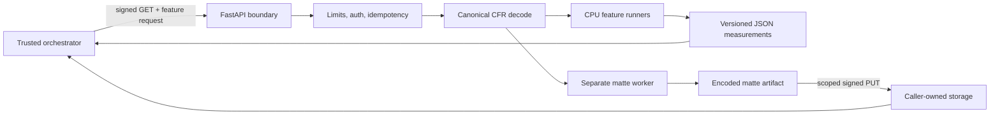

# Architecture

media-analysis is a stateless-by-contract measurement worker for short video.
The trusted caller owns durable jobs, public identifiers, storage, retries, and
product decisions. The worker owns bounded source access, canonical decoding,
model inference, measurements, and artifact checksums.

## Process boundaries

The `analysis-cpu` image supports three runtime roles. `general` owns subjects,
faces, shots, motion, quality, audio, waveform, exposure, and thumbnails;
`ocr` owns OCR (and optional shot detection); `combined` preserves the local and
backward-compatible single-service mode. Production should route OCR-only jobs
to `ocr` replicas and all other CPU jobs to `general` replicas so model sessions
do not compete for CPU or RAM. The `matte-cpu` image remains a separate reference
worker.

One process handles one active analysis at a time until load benchmarks justify
more concurrency. The process-local replay cache is bounded and is not a durable
job store. Each job records stage timings and byte counts, enforces a decoded
pixel ceiling plus per-stage deadlines, and reports FFmpeg/runtime identity in
`provenance`.

## Canonical media

Visual facts are measured against a constant-frame-rate proxy. All frame
intervals use half-open ranges, and all normalized geometry refers to the
canonical dimensions. This avoids source VFR timestamp ambiguity and lets
independent features share one coordinate system.

All sampled visual consumers use one thread-safe, byte-bounded frame cache per
request. Concurrent requests for the same frame are coalesced into one decode;
motion uses a downscaled grayscale view, while exposure uses a bounded color
view. OCR samples shot keyframes and cut bursts, face/person detectors run on a
periodic cadence and tracking fills the gaps. Frame access remains bounded rather
than retaining a full video in memory.
Evicted samples spill losslessly to a per-job temporary directory, capped by
`MEDIA_ANALYSIS_FRAME_SPILL_BYTES` (2 GiB by default). Later consumers reuse these
samples without decoding them again. If the disk budget is exhausted, further
samples use the bounded memory cache and `frameSpillLimited` reports the fallback.
Scene detection still owns a sequential scan, with compact gray samples retained
for motion/quality. This is shared sample reuse, not a guarantee that every frame
of the source bitstream is decoded only once.
Audio extraction produces canonical mono 16 kHz float32 PCM. Person-matte
inference runs on shot-reset keyframes and propagates alpha between them with
optical flow; encoding still streams grayscale frames to ffmpeg and validates
contiguous frame indices.

Independent OCR, audio, and general visual paths overlap in a bounded per-job
worker pool. Source bytes, canonical proxies, and JSON-only analysis results are
content-addressed by `source.sha256`, TTL-bound, and LRU-pruned. Signed URLs are
never cache keys, and cache hits still enforce URL and expiry policy.
Only completed analysis results are reused. Active jobs keep their own media
paths (hard links when possible), so TTL/LRU eviction cannot remove their input
before decode or upload. Cache publication and checkout coordinate across local
processes using a filesystem lock.

## Feature isolation

Each requested feature reports its own capability status and policy/model
provenance. Features share decode foundations but not a single confidence
score. Detection, association, occupancy, segmentation, and matting retain
their separate semantics.

Shots are foundational for shot-local tracking and per-shot measurements.
When trusted prior facts are supplied, fill-only features can reuse them;
otherwise the worker computes the required internal facts without adding
unrequested fields to the response.

## Model lifecycle

Matte motion propagation estimates backward optical flow on grayscale images
capped at 256 pixels on the longest side. The flow field is resized and its
x/y displacement scales restored before warping the full-resolution matte;
output mask resolution is unchanged. This is a versioned quality/performance
tradeoff and still needs real-person temporal-quality validation.

Models are never downloaded on the first request. Build or setup tooling reads
`models/manifest.lock.json`, downloads immutable artifacts, verifies byte size
and SHA-256, and writes the runtime manifest. Startup then verifies and warms
every model required by the selected image.

MODNet runtime selection supports TensorRT, CUDA, and CPU. The TensorRT provider
enables FP16 engine building and caching. A production matte deployment must set
`MEDIA_ANALYSIS_MATTE_EXECUTION_PROVIDER=tensorrt`; startup fails if the requested
GPU provider is unavailable. The checked-in matte artifact gate remains closed
until an owned immutable MODNet export passes the existing production gates.

Mechanical readiness and production readiness are separate:

- `ready` confirms the configured worker can serve its selected mode.
- `productionInferenceReady` confirms all explicit artifact, parity, and
  benchmark gates for that mode are open.
- `referenceMode` prevents stub or benchmark workers from being mistaken for
  production inference.

See [DEPLOYMENT.md](DEPLOYMENT.md) for the current open gates.

## Security model

The worker accepts only short-lived signed source and destination URLs whose
hosts match a configured allowlist. Redirect destinations are revalidated.
Requests use a shared service key, downloads are bounded, and logs must not
contain media or signed URLs.

This is defense in depth for a private compute service, not permission to expose
the worker directly to the public internet. See [SECURITY.md](../SECURITY.md).

## Testing strategy

Pure math and state transitions use fast unit tests. HTTP, ffmpeg, cancellation,
and signed source behavior use end-to-end tests through the real app. Production
contracts verify Docker and manifest rules, while opt-in tests download and warm
the real models. See [TESTING.md](TESTING.md).
