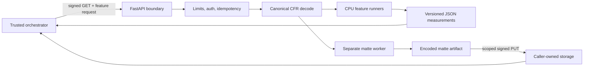

# Architecture

media-analysis is a stateless-by-contract measurement worker for short video.
The trusted caller owns durable jobs, public identifiers, storage, retries, and
product decisions. The worker owns bounded source access, canonical decoding,
model inference, measurements, and artifact checksums.

## Process boundaries

The `analysis-cpu` image owns subjects, faces, OCR regions, shots, motion,
quality, audio, waveform, exposure, and thumbnails. The `matte-cpu` image is a
separate v2 reference worker so heavy segmentation dependencies and production
gates cannot silently affect the CPU analysis worker.

One process handles one active analysis at a time until load benchmarks justify
more concurrency. The process-local replay cache is bounded and is not a durable
job store.

## Canonical media

Visual facts are measured against a constant-frame-rate proxy. All frame
intervals use half-open ranges, and all normalized geometry refers to the
canonical dimensions. This avoids source VFR timestamp ambiguity and lets
independent features share one coordinate system.

Frame access uses bounded caching rather than retaining a full video in memory.
Audio extraction produces canonical mono 16 kHz float32 PCM. Person-matte
encoding streams grayscale frames to ffmpeg and validates contiguous frame
indices.

## Feature isolation

Each requested feature reports its own capability status and policy/model
provenance. Features share decode foundations but not a single confidence
score. Detection, association, occupancy, segmentation, and matting retain
their separate semantics.

Shots are foundational for shot-local tracking and per-shot measurements.
When trusted prior facts are supplied, fill-only features can reuse them;
otherwise the worker computes the required internal facts without adding
unrequested fields to the response.

## Model lifecycle

Models are never downloaded on the first request. Build or setup tooling reads
`models/manifest.lock.json`, downloads immutable artifacts, verifies byte size
and SHA-256, and writes the runtime manifest. Startup then verifies and warms
every model required by the selected image.

Mechanical readiness and production readiness are separate:

- `ready` confirms the configured worker can serve its selected mode.
- `productionInferenceReady` confirms all explicit artifact, parity, and
  benchmark gates for that mode are open.
- `referenceMode` prevents stub or benchmark workers from being mistaken for
  production inference.

See [DEPLOYMENT.md](DEPLOYMENT.md) for the current open gates.

## Security model

The worker accepts only short-lived signed source and destination URLs whose
hosts match a configured allowlist. Redirect destinations are revalidated.
Requests use a shared service key, downloads are bounded, and logs must not
contain media or signed URLs.

This is defense in depth for a private compute service, not permission to expose
the worker directly to the public internet. See [SECURITY.md](../SECURITY.md).

## Testing strategy

Pure math and state transitions use fast unit tests. HTTP, ffmpeg, cancellation,
and signed source behavior use end-to-end tests through the real app. Production
contracts verify Docker and manifest rules, while opt-in tests download and warm
the real models. See [TESTING.md](TESTING.md).
