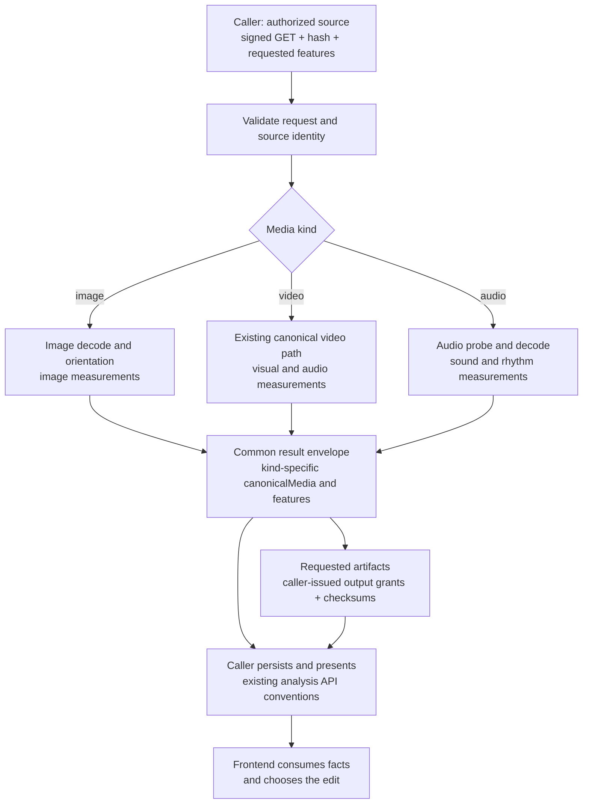
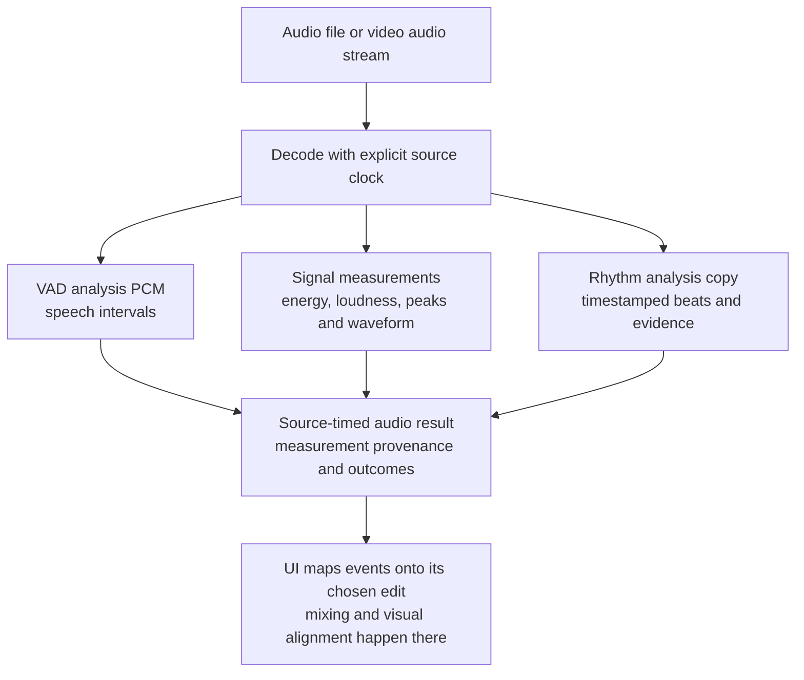

# Gold AI Home Tour — Media Analyzer Implementation Brief

**Work package:** Media-analyzer extensions, the starting work package for the complete Gold system.

**Status:** Implementation specification. This document adds no running feature and makes no deployment or model-quality claim.

**Baseline inspected:** `0363403`, 2026-09-16. Read the current code and tests before editing if the branch has advanced.

## 1. Objective and ownership

Extend this service to measure **native still images, video clips and standalone audio**, while retaining the existing video contract. Return useful source evidence that a frontend can interpret through its selected template.

The complete scope includes image geometry/quality/focus/saliency, reusable subjects/faces/text regions, standalone audio measurements and rhythm events, explicit capability discovery, canonical identity, correct clocks, and verified video/matte compatibility. These are one work package, not separate product editions.

| Owner | Responsibility |
| --- | --- |
| This repository | Decode/normalize media, measure facts, produce requested derived artifacts, expose capability/readiness and honest measurement outcomes |
| Caller backend | Authorize uploaded/shared/library assets, issue signed grants, persist public jobs and immutable results, coordinate transcription/enrichment/generation, assemble a collection of source results |
| Frontend | Choose transitions, effects, Ken Burns direction/path, shot timing, caption appearance, intro/outro, music placement and the final edit |
| Pacing service | Fit an explicit frontend-selected path/budget/anchor request; this is a separate computational contract |

**The analyzer does not choose a fade, a push-in, an effect, a caption style or an edit order.** It supplies dimensions, focus/regions, motion, boundaries, quality, speech intervals and audio events. Transcription and text/caption enrichment remain caller services; OCR here detects regions, not recognized copy or a transcript.

The caller's new Home Tour API uses `/api/v3/home-tour`. This worker continues using its internal `/analyze` contract. Do not move public workspace, template or material orchestration into the worker.

## 2. Existing implementation to preserve

| Area | Inspected behavior | Work needed |
| --- | --- | --- |
| Video input | Probe requires a video stream; canonical video and audio handling already exist | Preserve video behavior; dispatch other media kinds before video-only validation |
| Video measurements | Shots, subjects, faces, OCR regions, motion, quality, exposure, audio, waveform and thumbnails | Reuse existing fields/primitives and test actual caller compatibility |
| Motion | Frame-window magnitude, direction/coherence and camera-move segments | Use existing evidence; do not invent a transition-recommendation feature |
| Audio within video | Speech VAD, RMS, onsets, loudness, true peak, BPM and waveform | Reuse; do not confuse BPM or onsets with timestamped beats |
| Photos | No native image/saliency request/result path | Add image decoding, canonical image contract and image-specific features |
| Standalone audio | `decode.probe()` rejects media without a video stream | Add a real audio branch without fabricated video geometry |
| Mattes | Full-duration `all_people` path exists; subject-track targeting and segmented requests are rejected | Preserve supported behavior and qualify mask quality/readiness for consumers |
| Readiness | `/ready` reports models, role, runtime readiness and production blockers | Add media-kind/feature discovery tied to actual configured support |
| Request hashing | Explicit allowlist of request fields; signed URLs and expiries excluded | Include new kind/settings/grant roles; retain legacy video identity behavior |
| Results/cache | Worker produces measurement JSON and artifacts; local replay/cache mechanisms exist | Extend keys and recovery coverage without assuming the worker is a durable public job store |

Primary code: [schemas.py](../src/media_analysis/schemas.py), [decode.py](../src/media_analysis/decode.py), [analyze.py](../src/media_analysis/analyze.py), [motion.py](../src/media_analysis/features/motion.py), [audio.py](../src/media_analysis/features/audio.py), [app.py](../src/media_analysis/app.py).

Repository documentation describes unresolved real-model/production gates. Distinguish code presence, successful inference, reference/evaluation mode and approved output quality. Do not infer deployed readiness from a local README or unit test.

## 3. Shared flow



Keep each request about one source. The caller coordinates many clips/images and binds them to occurrences; the analyzer does not receive the tour timeline or neighboring clips' transition instructions.

## 4. Request and response compatibility

### Explicit media-kind dispatch

Add a validated discriminator such as `mediaKind: image | video | audio`. Omitted `mediaKind` retains existing video behavior. Verify decoded content agrees with the requested kind; MIME extensions alone are insufficient.

Dispatch before `run_analyze()` reaches video probing or `BoundedFrameAccess`. Changing only `_compute()` after the video-only probe will still reject audio-only input and mishandle images.

Keep `idempotencyKey`, `source`, `features`, `canonicalize` and signed output grants. For image/audio inputs, use kind-specific canonical metadata and measurement options rather than pretending they satisfy video's `fps/frameCount` fields. Require a verified source hash for new image/audio requests; validate it against downloaded bytes. Existing video callers retain their accepted wire form.

Proposed feature vocabulary, to be locked in schemas and fixtures before implementation:

| Kind | Features |
| --- | --- |
| Video | Existing feature IDs unchanged; additive rhythm support when requested |
| Image | `quality`, `exposure`, `subjects`, `faces`, `ocr`, `thumbnails`; new `focus` and `saliency` |
| Audio | `audio`, `waveform`; new `rhythm` |

Reject incompatible requests such as image `motion`, audio `faces`, or image matte-frame ranges with the existing invalid-request convention. A recognized but unavailable model/capability must report that outcome explicitly. Preserve existing cancellation, deadline and error behavior.

### Preserve the worker/public-response boundary

Existing worker response fields are:

```text
schemaVersion, overallStatus, requestedFeatures, canonicalMedia,
capabilities, requested feature bodies, provenance, warningCodes
```

The caller adds public `analysisId`, `resultVersion`, `mediaFingerprint`, asset/derived IDs, storage references and authorized delivery. Those fields are not all present in this worker's current result; do not add a duplicate public ID/database layer here.

For existing video requests, preserve feature names, shapes, source-frame meanings, optionality and capability statuses. Current frontend video/caption parsers must continue to accept the caller's presented result without a replacement parser.

For image/audio, extend the common envelope with an explicit kind and typed `canonicalMedia`/feature branches. Reuse shared box, polygon, status, hash and artifact structures where the semantics match. Do not force image quality into a fake `perShot` video list, or force audio events onto an invented 30 fps clock.

Preserve these distinctions:

- Unrequested measurement: omitted feature body.
- Completed measurement with no detections: completed capability and empty result.
- Requested measurement unavailable/failed: explicit capability outcome and warning/error.
- Silence, no audio stream, unknown speech and failed VAD: different evidence states.
- Unsupported format/kind or undecodable source: explicit request/decode failure, not an empty successful result.

Contract fixtures must include the old video request/result and each new branch. Technical schema revisions identify compatibility; they do not rename the product or split its capability set.

## 5. Native image preparation

### Decode and canonical image

Decode real still images. Normalize EXIF orientation and record the original-to-canonical transform, dimensions, MIME/format, alpha handling, color conversion policy, content hash and canonicalization identity. Declare accepted formats explicitly and test them, including phone-origin formats the caller advertises. Do not silently treat an animated image as a static photo; detect it and follow an explicit supported policy.

Keep source resolution independent of analysis working resolution. Bound compressed bytes and decoded pixels before allocating large buffers. Define ICC/color conversion and transparent-image analysis behavior so quality measurements and preview pixels refer to the same canonical appearance. Preserve a suitable canonical asset instead of baking a template crop into it.

Add `canonicalImage` to output-grant roles while retaining `canonicalMp4` unchanged. Upload only when a canonical artifact is requested, with declared MIME, byte count and checksum. Metadata-only analysis must not need a fabricated upload grant.

### Image measurements

| Measurement | Required output semantics |
| --- | --- |
| Geometry | Original/canonical dimensions, orientation/transform, aspect and analysis scale |
| Quality | Sharpness and clipping measurements with working resolution and policy identity; do not label a hand-tuned score as a probability |
| Exposure/color | Measured luma, contrast and applicable color summaries, with color-space definition |
| Subjects/faces | Still-image detections in normalized canonical coordinates; no invented temporal tracks or person identity |
| Text regions | Detection polygons/regions for placement avoidance; no inferred recognized text |
| Saliency | Measured/model-derived regions or referenced saliency artifact, model identity, score semantics and validity |
| Focus | One or more candidate points/regions tied to saliency/subjects and their evidence; distinguish inferred focus from a user-selected point |
| Thumbnails | Image derivative metadata without fake shot indices/source frame numbers |

Reuse pixel-level detectors and color/sharpness primitives where valid. Avoid passing an image through video shot tracking just to obtain the same output keys. Source regions use normalized coordinates relative to the oriented canonical image; record analysis-to-canonical scaling separately.

A saliency model or focus policy needs a pinned reproducible implementation and fixtures. Register required models through the existing manifest/warmup path, and report model/policy score type honestly. A center fallback may be a caller display choice; do not report it as measured focus with invented confidence.

The frontend computes its crop, zoom, pan direction, travel and duration. Analyzer output must not include `kenBurnsPreset`, a selected camera treatment or a recommended transition.


## 6. Standalone audio and rhythm

### Decode and clocks

Add audio-only probing/validation, retaining source duration, codec, sample rate, channels and content identity. Separate the playback source from analysis PCM. The analysis copy may be mono/resampled; it must not replace the original stereo playback asset.

Record timestamp origin, decoder delay/padding treatment and analysis recipe so events map to the actual playback source. Audio-only events use seconds and, where useful, sample indices tied to a declared sample rate. They have no image width/height, video fps or frame count. Existing video-audio frame fields retain their current meanings.

Keep the existing 16 kHz VAD path intact. Rhythm analysis can use its own declared sample rate/hop; do not silently change VAD settings to accommodate a beat tracker. If producing a canonical audio artifact, introduce a `canonicalAudio` output-grant role with format/hash metadata and an explicit playback-time mapping. Do not upload internal analysis PCM as an undeclared playback replacement.

### Measurements and evidence

Reuse speech VAD, RMS/energy, onsets, integrated loudness, true peak and waveform primitives. Implement timestamped beats under a separate requested `rhythm` feature, with detector/policy version, evidence tier and reasons. The existing Home Tour rhythm implementation is a reference for beat extraction and synthetic fixtures; integrate the behavior through this repo's request, provenance, cancellation and cache contracts rather than adding a second embedded HTTP service.

Wire `rhythm` into audio preparation dependencies as well as the feature enum. `AUDIO_FEATURES` currently exists in both `analyze.py` and `decode.py`; both paths must recognize a rhythm-only video request, including when `canonicalize` is false. A rhythm function alone does not ensure audio is decoded for that request.

Beat timestamps, onsets and BPM are different facts. Do not infer verified downbeats, bar boundaries or phrases from every fourth beat. Preserve silence/ambient/irregular-music outcomes without manufacturing a trusted beat grid.

For effects, expose acoustic peak/onset candidates with source offsets and measurement provenance where useful. A detected acoustic peak is not a verified semantic impact. Curated impact markers can remain caller metadata. The UI decides which event to align and where to place the effect.

The service measures raw source time. It does not trim a soundtrack to the tour, loop it, duck it under a voice, or produce final gain envelopes. The caller/UI applies the chosen trim and occurrence mapping; looped playback requires the UI to expand the event map.



## 7. Video evidence and matte compatibility

Retain existing `shots`, motion windows, camera-move segments, quality, exposure, audio and region results. They already provide much of the evidence a template needs near selected clip boundaries. Consumers can inspect those source ranges; do not add a `recommendedTransition` field or a duplicate Home Tour video-analysis shape.

Keep canonical RGB/audio alignment and source-frame bounds correct for VFR and rotated inputs. Preserve original voice. Document current normalization behavior and make source limits versus canonical-output limits explicit: a phone upload must not be advertised as supported when the worker rejects it before normalization. Resolve advertised format/resolution support through capabilities and tested decode policy, not hidden downscaling in the caller.

For behind-subject effects, retain full-duration masks and their canonical RGB alignment. Validate geometry, frame count, checksum, encoding and policy identity. Document and expose unsupported targeting/range options. Do not claim that an all-people mask isolates the primary presenter from a reflection or bystander.

Real mask quality acceptance covers hair/hands, occlusion, motion, shot resets and temporal artifacts. Reference/evaluation mode remains explicit. Model success or an existing MP4 is not production quality evidence. Do not broaden mask-targeting semantics merely to satisfy a template flag; callers need accurate capabilities and source facts.

## 8. Capability discovery, identity, caching and operations

### Discovery and runtime

Add a worker capability response, preferably a dedicated read-only `/capabilities`, and share its data model with readiness. Report supported media kinds/features, required models, canonical artifact formats, input formats/technical bounds, and algorithm identities. Distinguish implemented, configured, model-ready and production-qualified states. Keep existing `/health` and `/ready` fields stable.

Runtime initialization should load only models required by the worker's configured feature set. An audio-only role must not need face/OCR/matte models to become ready. Preserve worker-role separation for matte and normal analysis. All features in this brief belong to the complete system; worker roles are deployment/resource boundaries, not reduced product editions.

### Identity and caching

`request_hash.py` uses an explicit allowlist. Add media kind, all relevant image/audio/rhythm settings, and new artifact-grant roles to its canonical hash inputs. Preserve the existing digests for unchanged legacy video requests and make explicit video equivalent to omitted kind; adding a default `mediaKind: video` field unconditionally would break those hashes. Include distinct image/audio kind identities and new nondefault settings. Pin legacy digest fixtures, not only equality between two new requests. Keep signed URLs/expiry values out of identity while retaining stable requested artifact roles.

A refresh of download/upload grants must not change the measurement identity. Revise replay so reusable measurements and artifact delivery are handled separately. The current `app.py` in-memory replay returns cached JSON before `run_analyze()` and therefore does not fulfill newly supplied PUT grants. Reuse a verified artifact or fulfill the current requested delivery as needed; do not claim a fresh upload merely because cached JSON was returned. Missing artifacts must be restored or fail truthfully without losing the reusable measurements.

Current disk-result caching accepts completed results and excludes thumbnail/matte-producing requests. Decide explicitly how image/audio derivative requests participate: either reuse verified cached artifacts and fulfill the current grants, or retain an artifact-aware recomputation path. Extending the cacheable feature list alone is insufficient.

Cache measurements using source bytes, request settings, canonicalization recipe, model identities and every active analyzer/policy version. Include new image/rhythm identities and existing audio-policy identities explicitly rather than relying solely on a package-version bump. Do not include frontend template, transition, placement, volume or draft ID in raw measurement keys.

Keep source SHA verification, bounded downloads, redirects/host policy, cancellation and subprocess deadlines. Add image decompression and audio-duration/channel limits. These bounds protect individual executions; caller fan-out and horizontal workers handle larger material collections.

### Database boundary and telemetry

No application database migration belongs in this repository. The caller owns durable parent/child jobs, public IDs, immutable result snapshots, permissions and artifact retention. Worker-local job/replay state is not a replacement for that store. Extend the filesystem cache manifest/index format as necessary with safe invalidation of incompatible entries.

`JobRegistry` and the synchronous inference lock are process-local. Cross-worker deduplication and restart recovery require the caller's durable task identity; do not infer them from local replay behavior. Preserve cache file locking and atomic writes when introducing additional media-kind workers.

Measure stage time by media kind and feature, cold/warm behavior, cache hits, downloaded/decoded sizes, RAM, timeout/cancellation and partial failures. Use the existing telemetry/metrics path. Do not add private caller asset URLs, user identities, transcripts or project configuration to logs, fixtures or public docs.

## 9. Module and file plan

| Module/files | Classification and change |
| --- | --- |
| [schemas.py](../src/media_analysis/schemas.py), [config.py](../src/media_analysis/config.py) | Boundary: media-kind schemas, feature matrix, kind-specific settings and output grants |
| [app.py](../src/media_analysis/app.py), [runtime.py](../src/media_analysis/runtime.py) | Boundary: capability discovery and feature/model readiness; preserve existing HTTP behavior |
| [analyze.py](../src/media_analysis/analyze.py) | Orchestration: common download/identity/artifact flow and kind-specific dispatch; preserve existing video path |
| [decode.py](../src/media_analysis/decode.py), new image/audio decode modules | Deep: separate kind-specific probe/decode from shared bounded execution; avoid a fake universal video object |
| [features/](../src/media_analysis/features/) | Deep: native image geometry/quality/focus/saliency and audio/rhythm measurements; reuse tested detector/DSP primitives |
| [frames.py](../src/media_analysis/frames.py), [frame_access.py](../src/media_analysis/frame_access.py) | Preserve video frame behavior; image pixel coordinates and audio samples have explicit separate models |
| [models_manifest.py](../src/media_analysis/models_manifest.py), model tools/locks | Boundary: declared model artifacts, warmup and provenance for any added model |
| [request_hash.py](../src/media_analysis/request_hash.py), [cache.py](../src/media_analysis/cache.py), [jobs.py](../src/media_analysis/jobs.py) | Deep: compatibility, new settings identity, replay/invalidation and cancellation behavior |
| [telemetry.py](../src/media_analysis/telemetry.py), [errors.py](../src/media_analysis/errors.py) | Extend measurements/error coverage without breaking existing meanings |
| [API.md](API.md), [ARCHITECTURE.md](ARCHITECTURE.md), [DEPLOYMENT.md](DEPLOYMENT.md), [TESTING.md](TESTING.md) | Document supported kinds, exact response examples, readiness and verification evidence |

Parallel areas of work: schemas/fixtures, image processing, standalone audio/rhythm, runtime/cache plumbing, video/matte regression and integration verification. Agree shared fixtures first; these are dependency seams within one scope, not a phased feature roadmap. Keep algorithms behind stable request/result interfaces and avoid wrappers that merely rename existing fields.

## 10. Acceptance tests

### Compatibility and feature semantics

- Recorded legacy video requests produce the same required result shapes; omitted kind remains video.
- Explicit video, image and audio requests dispatch correctly. Wrong kind/feature, invalid grants and undecodable content fail honestly.
- Public caller fixtures still pass existing video/caption response parsers after presentation. Image/audio branch fixtures pass their additive schemas.
- Omission, completed empty result, absent audio, verified silence, unavailable model and feature failure remain distinguishable.
- Video motion/exposure output contains measurements only; no transition/effect/camera-style selection appears in worker responses.

### Image fixtures

- Portrait/landscape photos, EXIF rotations, transparency, unusual dimensions/color profiles and advertised phone formats.
- Exact original/canonical coordinate transforms, bounded normalized boxes and no duplicate orientation application.
- Blurred, dark, overexposed, text-heavy and edge-subject images; real quality/focus evidence with honest score semantics.
- Valid no-face/no-text cases versus unavailable detection; no invented image fps, duration, shot list or video frame indices.
- Model fixtures with known salient regions and a reviewed real-image corpus; detector accuracy and focus usefulness reported separately.

### Audio fixtures

- Mono/stereo tracks, silence, speech, ambience, irregular music, short effects and every advertised codec.
- Independently generated click tracks with known tempo/phase, leading silence, tempo changes and missing beats. Measure missing/extra events and timestamp error separately.
- Rhythm-only requests on video with/without audio and with `canonicalize: false`; verify audio dependencies run and absent audio is reported accurately.
- Decoder offsets/padding, duration/sample-count consistency and no use of fabricated video fps for audio-only events.
- Real speech VAD and music evidence tested independently; a BPM or onset list alone cannot claim beat alignment.
- Loudness/true-peak provenance and graceful cases where a measurement cannot be computed.

### Artifacts, cache and operations

- New grant roles preserve checksum, MIME and byte count; missing cached artifacts are restored or fail truthfully.
- Changed kind/settings/analyzer/model/source bytes invalidate the right cache entries; renewed signed grants do not remeasure identical bytes. Exact legacy video hash fixtures remain unchanged, including equivalence with explicit video kind.
- Concurrent same-key requests, conflicting request reuse, cancelled downloads/decode/inference, timeout cleanup and restart recovery through caller retries.
- Bad hashes, oversized/decompression-heavy media, expired/unauthorized grants and malformed codec metadata are bounded.
- Audio-only readiness works without visual models; mask readiness is reported separately from measurement readiness.

### End-to-end and quality evidence

Run a source through signed input, requested features, artifact upload and caller presentation. Verify canonical source/frame/sample identities agree with the UI's decoded asset. Validate preview/export masks and audio timing through the caller integration rather than treating valid JSON as visual/audio approval.

Use generated/local fixtures for deterministic tests and rights-cleared real media for model/quality evaluation. Do not copy private property media, signed URLs or caller credentials into this repository. Real-model evaluation follows the repository's existing explicit model setup and production-test procedures.

## 11. Working commands and definition of done

Existing repository commands, to run during implementation in its Python 3.12 environment:

```sh
pytest tests/unit -m unit
pytest tests/e2e -m e2e
pytest -m ffmpeg
ruff check src tests
pytest
```

Focused existing tests include `test_schemas.py`, `test_analyze_rules.py`, `test_request_hash.py`, `test_decode_audio.py`, `test_audio_analyzer.py`, `test_silero_vad.py`, `test_waveform_analyzer.py`, `test_motion.py`, `test_quality.py`, `test_exposure.py`, `test_cache.py` and the HTTP readiness/pipeline tests. Add behavioral image/audio-kind/rhythm tests alongside them. Default suites exclude explicit real-model execution; report that gap and provide separate quality evidence. This brief has not run the implementation suites.

This work package is complete when:

- [ ] Native image and standalone-audio requests work through the real `/analyze` path.
- [ ] All declared measurement families are implemented with explicit outcomes, provenance and usable artifacts.
- [ ] Existing video requests/results remain compatible and reusable by current caller parsers.
- [ ] Image coordinates and audio/video clocks are independently validated.
- [ ] Capability/readiness accurately identifies available models, media kinds and quality status.
- [ ] Request hashes/cache keys cover every new behavior-affecting input and policy.
- [ ] Cancellation, failure, replay, source bounds and artifact renewal tests pass.
- [ ] Runtime/model/quality results are documented without promoting stubs or evaluation output to production approval.
- [ ] Caller integration fixtures prove source results can be associated without redesigning existing video/caption payloads.
- [ ] API/setup documentation and a concise caller handoff identify exact new fields, errors, capabilities and artifact grants.

## 12. Decisions to record while implementing

Lock image format/color/alpha policy, saliency/focus implementation and model provenance, audio canonicalization/delay policy, exact new feature schemas and capability discovery fields in tests and API documentation. Preserve existing model-license and vendoring constraints. The rhythm algorithm may reuse existing Home Tour behavior, but its evidence calibration and timestamps still require validation here.

These decisions determine correctness and interoperability. They do not reduce the agreed complete measurement scope or transfer editing decisions from the UI into this worker.
